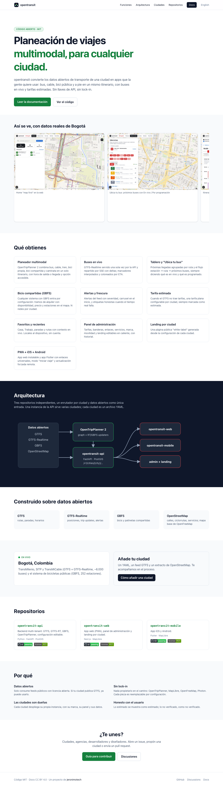
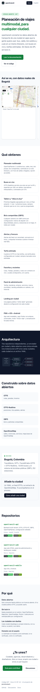

# opentransit

**Open-source, multi-city, multimodal trip planning on open data.**

[](https://github.com/jeronimotech/opentransit/actions/workflows/deploy.yml)
[](LICENSE)
[](https://creativecommons.org/licenses/by/4.0/)

This repository is the **project hub**: the landing page and the developer documentation, published at
**https://jeronimotech.github.io/opentransit/** (Spanish by default, English at `/en/`).

opentransit takes the open data a city already publishes (GTFS, GTFS-Realtime, GBFS, OpenStreetMap) and delivers a
web app, a mobile app and an admin panel. No API keys, no proprietary services, MIT licensed. First city on live data:
Bogotá.

| Repository | What | Stack |
|---|---|---|
| [opentransit-api](https://github.com/jeronimotech/opentransit-api) | Multi-tenant backend: city registry, GTFS ingest, live GTFS-RT, bike-share (GBFS), routing via OpenTripPlanner, runtime-editable config | Python · FastAPI · PostGIS · OpenTripPlanner 2 |
| [opentransit-web](https://github.com/jeronimotech/opentransit-web) | Web app (PWA), admin panel, per-city landing | Next.js · TypeScript · MapLibre |
| [opentransit-mobile](https://github.com/jeronimotech/opentransit-mobile) | iOS / Android app | Flutter · MapLibre |

<p>
  
  
</p>

## Docs

- [Getting started](https://jeronimotech.github.io/opentransit/docs/getting-started/) · [Architecture](https://jeronimotech.github.io/opentransit/docs/architecture/) · [Adding a city](https://jeronimotech.github.io/opentransit/docs/adding-a-city/)
- [Admin panel](https://jeronimotech.github.io/opentransit/docs/admin-panel/) · [Web app](https://jeronimotech.github.io/opentransit/docs/web-app/) · [Mobile app](https://jeronimotech.github.io/opentransit/docs/mobile-app/) · [Data quality](https://jeronimotech.github.io/opentransit/docs/data-quality/)
- [API reference](https://jeronimotech.github.io/opentransit/docs/api/) · [Roadmap](https://jeronimotech.github.io/opentransit/docs/roadmap/) · [FAQ](https://jeronimotech.github.io/opentransit/docs/faq/)
- [Contributing](https://jeronimotech.github.io/opentransit/docs/contributing/) · [Governance](https://jeronimotech.github.io/opentransit/docs/governance/) · [Security](https://jeronimotech.github.io/opentransit/docs/security/) · [License](https://jeronimotech.github.io/opentransit/docs/license/)

## Working on this site

Astro + Starlight, Tailwind, no external services. Spanish sources in `src/content/docs/docs/`, English in
`src/content/docs/en/docs/`; the landing is `src/components/Landing.astro` (both languages).

```bash
npm ci
npm run dev                 # http://localhost:4321/opentransit/
npm run build && npm run check:links
npm run preview & npm run screenshots   # docs-screenshots/ (Playwright)
```

Deploys to GitHub Pages on every push to `main` (`.github/workflows/deploy.yml`).

## Community

- Questions and ideas: [Discussions](https://github.com/jeronimotech/opentransit/discussions)
- Propose a city: [New city issue](https://github.com/jeronimotech/opentransit/issues/new/choose)
- Security: [SECURITY.md](SECURITY.md) · Conduct: [CODE_OF_CONDUCT.md](CODE_OF_CONDUCT.md) · Contributing: [CONTRIBUTING.md](CONTRIBUTING.md)

Code is MIT; documentation content is CC BY 4.0. Data belongs to each transit agency under its own license.
